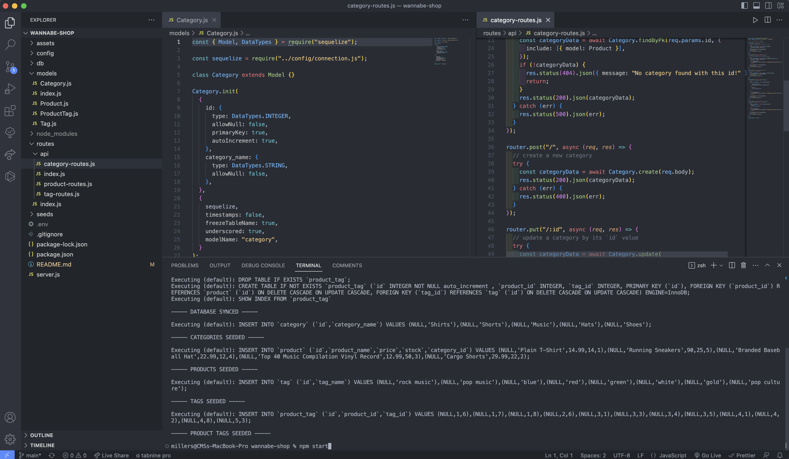
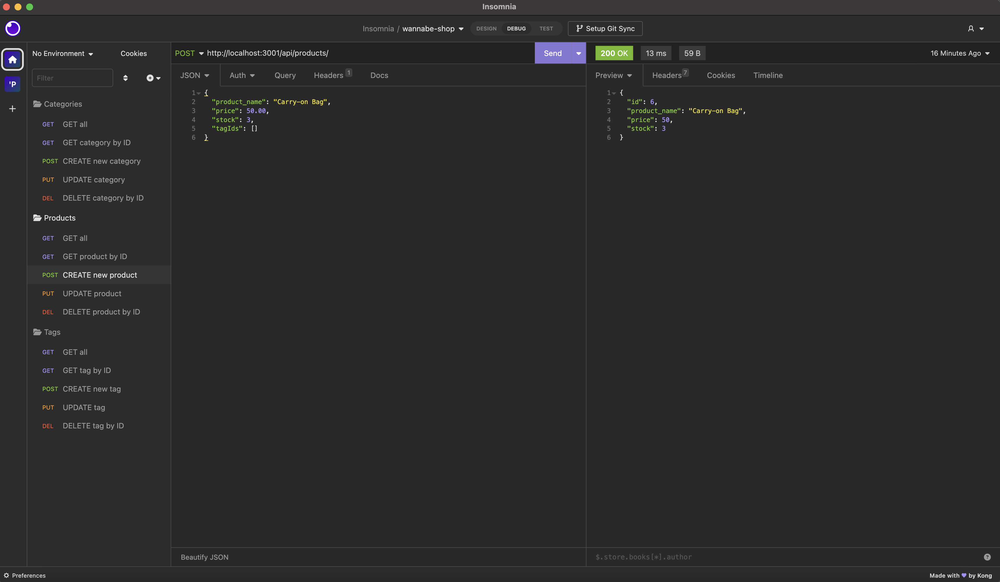

# Wannabe Shop

## Table of Contents

- [Description](#description)
- [License](#license)
- [Installation](#installation)
- [Usage](#usage)
- [Contributing](#contributing)
- [Tests](#test)
- [Questions](#questions)

## Description

This is a demonstration of building a backend database for an e-commerce website.

## Installation

This application requires installing MySQL, Sequelize, dotenv, and Insomnia or another API testing program.

## Usage

This application is meant to be used to store a shop's inventory data.

[Click here to view a demonstration video](https://youtu.be/gHMzCeHB86s)

## License

This project uses MIT
[Click here to view license](https://opensource.org/licenses/MIT)

## Contributing

Contact me

## Tests

N/A

## Questions

- Author: Stevie Miller
- GitHub: [StevieMiller](https://github.com/StevieMiller)
- Email: stephanie.miller@carlsbadschools.net
